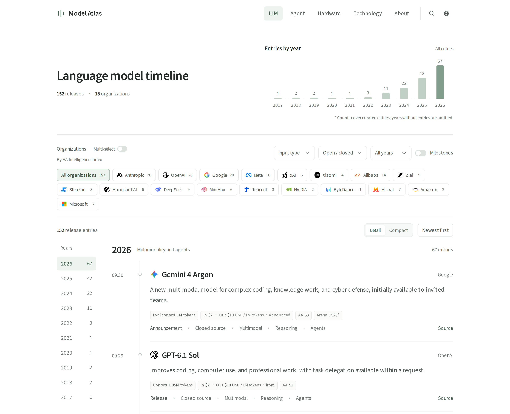
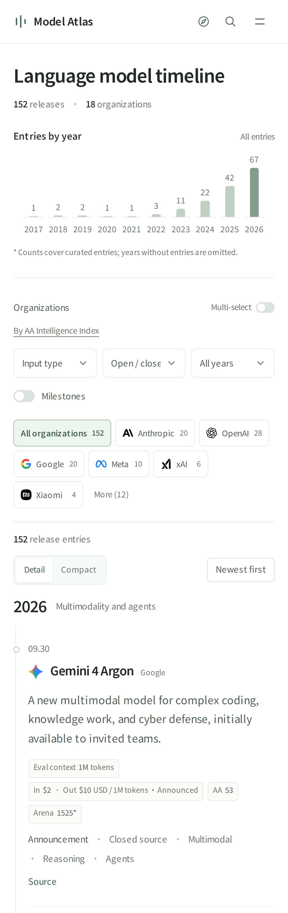
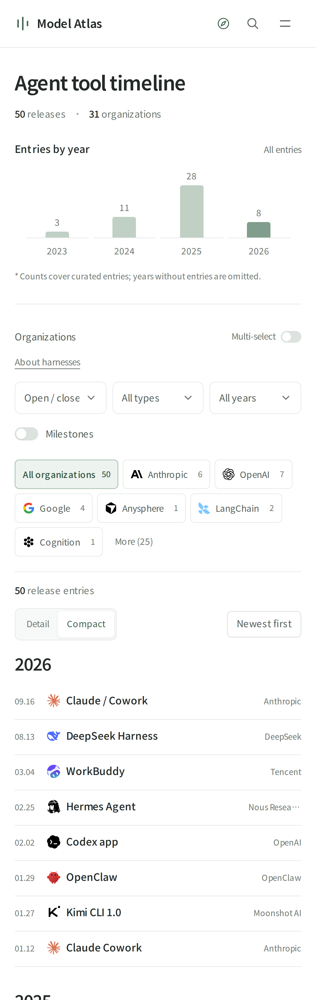

# Model Atlas

A curated timeline of AI models, agents, hardware, and key technologies.

English · [简体中文](README.zh-CN.md)

[Live site](https://ai.taifua.com) · [Contributing](#contributing) · [License](#license)



<details>
<summary>Mobile preview</summary>

Left: models in detailed view. Right: agents in compact view.

<p align="center">
  
  
</p>

</details>

## Four timelines

| Timeline | Coverage |
| --- | --- |
| Models | Major model releases and architecture papers, with context windows, API prices, and evaluation snapshots where available. |
| Agents | Coding and general-purpose agents, harnesses, frameworks, and protocols. |
| Hardware | GPUs, dedicated accelerators, systems, and local devices, with configuration-specific specifications. |
| Technology | Foundational methods, frameworks, inference tools, containers, and sandboxes. |

Entries are selected for historical influence or technical significance. This is a curated reference, with source links and explicit date conventions, rather than an exhaustive release feed.

## Explore

- Filter by organization, year, and type; share the resulting URL. Header search covers all timelines. Organization selection is single by default, with a multi-select switch for comparisons.
- Switch between detailed cards and a compact list, with newest entries first.
- Browse annual and monthly counts for the current selection.
- Open [Explore](https://ai.taifua.com/explore.html?lang=en) from the compass button in the header. It presents all cataloged events across the four timelines in monthly groups, from newest to oldest, with same-day events shown together and horizontal year and month navigation.
- Open an entry for its release scope, specifications, and sources. Browser Back closes details and Forward reopens them, preserving the selected filters.
- Use Chinese or English. The home page initially follows the browser language; manual choices are remembered, with dedicated URLs for each language.
- Browse on desktop or mobile, with keyboard navigation and reduced-motion support.

Switching multi-select off keeps the most recently selected organization. Existing links with several organizations open in multi-select mode. Paper entries prefer project or product marks, then official organization logos; arXiv or NeurIPS marks provide a fallback when no such logo is available.

Mobile organization filters initially show six organizations plus the selected ones. Additional organizations are available through the disclosure control. Desktop shows all organizations. The Milestones filter hides organizations with no matching entries.

Explore keeps all records and summaries visible, with the latest events first. Year and month controls navigate within the page, and search highlights and locates matching events. Category badges distinguish models, agents, hardware and technology. Sources and date notes explain whether an event records a paper presentation, package release or commercial deployment. The Transformer event appears once across timelines. Evaluation references link to AA, Arena, SWE-bench, and MLPerf; model details retain reviewed scores and snapshot dates.

The website uses local fonts and icons, with Latin and CJK font subsets requested according to the characters on the page. There are no analytics, runtime API calls, or third-party scripts. Browser storage saves only language and view preferences.

## Run locally

Use **Node.js 22 or 24 LTS**. Previewing, data checks, and builds need no npm dependencies; browser tests use development dependencies.

```bash
git clone https://github.com/taifuer/model-atlas.git
cd model-atlas
npm run dev
```

Open [localhost:5173](http://localhost:5173). To choose an address or port:

```bash
npm run dev -- --host 127.0.0.1 --port 5173
```

## Check and build

```bash
npm run check
npm test
npm run build
```

The build creates `dist/` with six page types in Chinese and English, a sitemap, and local assets. Deploy that directory to any static host; no Node.js process or backend is needed in production. Asset URLs include content hashes for cache updates. CI runs the same checks on Node.js 22 and 24, plus a separate Chromium browser regression job.

To run browser checks for the first time:

```bash
npm ci
npx playwright install chromium
npm run test:browser
```

The tests build and serve the site locally, covering Chinese/English desktop and mobile flows, detail history, global search, short-screen dialogs, static content, and font requests. Test dependencies are not included in the published site.

Chinese pages are served from the site root, with English editions under `/en/`. Each static page includes localized titles, descriptions, keywords, canonical and hreflang links, and social metadata. The build also generates `sitemap.xml` and `robots.txt`. For another deployment domain, use `BASE_URL=https://example.com npm run build`. Existing `?lang=en` / `?lang=zh` links remain supported.

The build writes default entries, dates, summaries, sources, and counts directly into HTML. The timelines remain readable without JavaScript; browser scripts add filters, search, and detail dialogs. Header search uses the same matching rules everywhere, including typographic hyphens. Selecting a result opens its details; Enter shows all matches in Explore.

## Data and sources

Records are maintained manually. Dates distinguish papers, announcements, previews, releases, and availability. Specifications and prices apply to the named version and configuration; leaderboard results retain their metric and snapshot date. Missing information stays absent.

Evaluation references include [Artificial Analysis](https://artificialanalysis.ai/leaderboards/models), [Arena](https://arena.ai/leaderboard/text), [LiveBench](https://livebench.ai/), [HELM](https://crfm.stanford.edu/helm/capabilities/latest/), [OpenCompass](https://rank.opencompass.org.cn/), [SWE-bench](https://www.swebench.com/), [Terminal-Bench](https://www.tbench.ai/), and [MLPerf](https://mlcommons.org/benchmarks/inference-datacenter/). They inform curation and are not combined into a single score.

The site's “open / closed” filter is an editorial classification of the listed models and tools. It does not describe this repository's license or replace each product's license terms. The [About page](https://ai.taifua.com/about.html?lang=en) explains the conventions.

## Project structure

| Files | Purpose |
| --- | --- |
| `src/` | Website source: six page templates, frontend JavaScript, CSS, data, and favicon. |
| `src/data*.js` | Bilingual entries, classifications, specifications, prices, and scores. |
| `src/app.js`, `src/filters.js`, `src/site.js`, `src/icons.js`, `src/styles.css` | Rendering, filtering, navigation, language, and layout. |
| `src/assets/` | Local font, icons, and their notices. |
| `scripts/` | Development server (`dev.mjs`), static build, and optional font-subsetting tool. |
| `tests/` | Data and behavior checks, dated score fixtures, and browser regressions in `tests/browser/`. |
| `docs/` | Documentation assets, including desktop and mobile previews. |
| `dist/` | Generated static site, excluded from Git. |

Edit the website in `src/` and run the npm commands from the repository root. The optional font tool is documented in [FONT-NOTICE.md](src/assets/FONT-NOTICE.md). Private research notes, local configuration, and deployment backups are excluded from the repository and build.

## Contributing

Corrections and additions are welcome through issues or pull requests.

- Explain an entry's historical significance, technical representativeness, or demonstrated influence. For hardware, distinguish documented architectural contributions from evidence of adoption for the specific chip or system.
- Provide reliable sources and event dates; match specifications, prices, and scores to the exact version or configuration. Write original summaries rather than copying source pages.
- Update Chinese and English together, preserve stable IDs, and leave unverified information absent.
- Run `npm run check`, `npm test`, and `npm run build`; check mobile and desktop layouts when changing the interface.

## License

Original code and original editorial text are available under the [MIT License](LICENSE). Noto Sans SC uses [SIL Open Font License 1.1](src/assets/OFL.txt); see the [font notice](src/assets/FONT-NOTICE.md). Icon sources and their recorded licenses are listed in the [icon notices](src/assets/icons/NOTICE.md).

External data, evaluation material, and brand marks are not relicensed under MIT; their respective rights and terms still apply. The project is independent of the organizations it documents.
