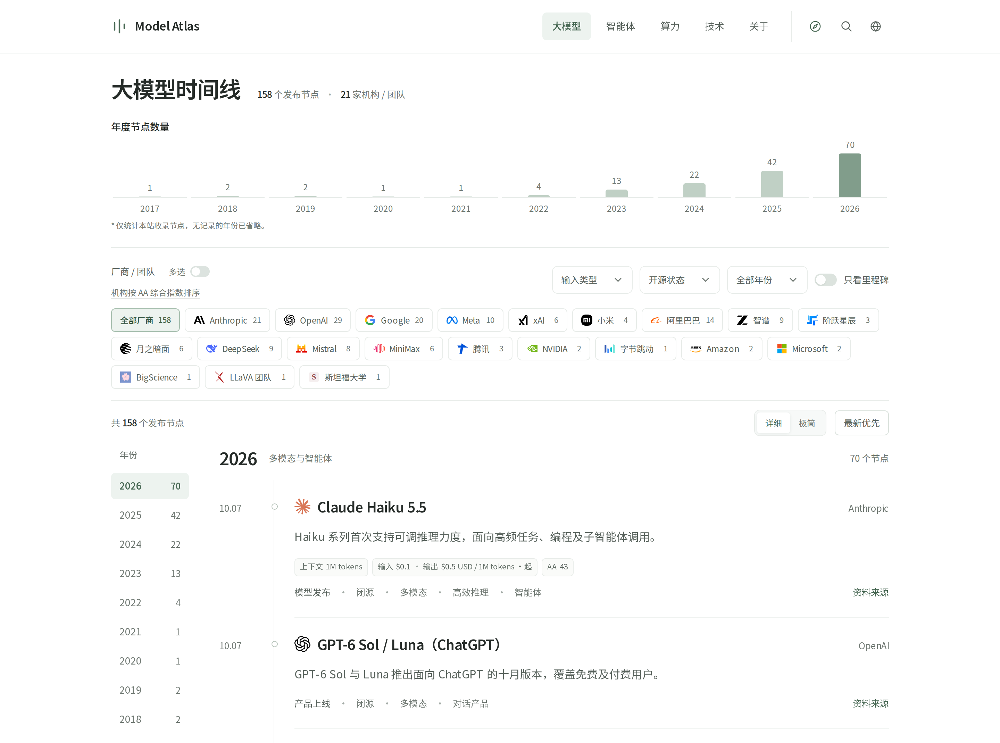
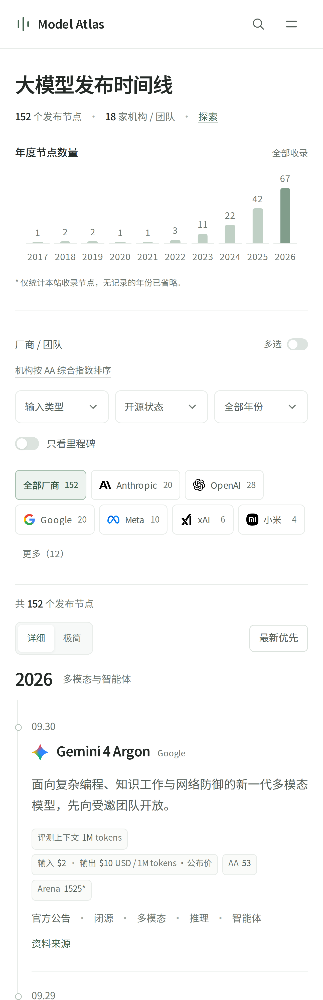
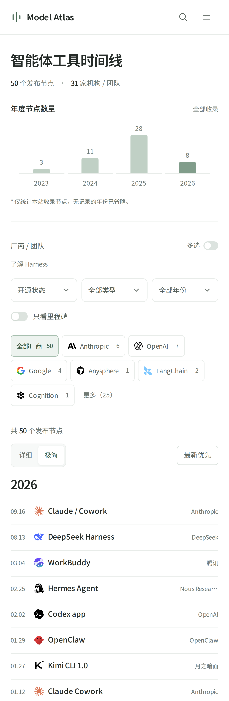

# Model Atlas

AI 模型、智能体、算力硬件与关键技术的发展时间线。

[English](README.md) · 简体中文

[在线访问](https://ai.taifua.com) · [参与贡献](#参与贡献) · [许可](#许可)



<details>
<summary>移动端预览</summary>

左：大模型详细视图；右：智能体极简视图。

<p align="center">
  
  
</p>

</details>

## 四条时间线

| 板块 | 内容 |
| --- | --- |
| 大模型 | 主要模型发布与架构论文，附可核实的上下文、API 价格和评测快照。 |
| 智能体 | 编程与通用智能体、Harness、框架和协议。 |
| 算力硬件 | GPU、专用加速器、算力系统与本地设备，规格注明具体配置。 |
| 技术 | 基础方法、计算框架、推理部署、容器与沙箱。 |

优先收录经典、具有技术代表性或可验证影响力的事件。每个节点保留来源与日期口径，以资料质量为先。

## 浏览功能

- 按机构、年份和类型组合筛选，通过链接分享当前结果；页头搜索覆盖全部时间线。机构默认单选，可开启“多选”同时查看多家。
- 详细与极简视图，默认按时间倒序排列。
- 年度与月度数量图表，跟随当前筛选条件统计。
- 通过页头的指南针按钮进入[探索页](https://ai.taifua.com/explore.html?lang=zh)，将四条时间线的全部已收录事件按月归组、从新到旧展示，同日事件集中呈现，并提供横向年月导航。
- 节点详情展示事件范围、规格和原始来源；浏览器后退关闭详情、前进重新打开，保留原筛选条件。
- 中英文切换，首页首次访问匹配浏览器语言，记住手动选择；中英文页面也有固定地址。
- 桌面与移动端适配，支持键盘操作及减少动画偏好。

关闭多选时保留最近选中的机构；原有多机构分享链接会自动开启多选。论文节点优先使用项目或产品标识，其次使用机构官方标识；没有这类标识时，再使用 arXiv 或 NeurIPS 等已记录来源的图标。

移动端机构筛选默认展示六家及已选机构，其他机构可展开查看；桌面端显示全部机构。开启“只看里程碑”时，没有匹配节点的机构会直接隐藏。

全站搜索采用统一匹配规则，兼容常见连字符写法；选择结果打开详情，按 Enter 在探索页查看所有匹配记录。探索页默认显示最新进展，全部记录与摘要始终可见。年月导航用于页内定位，搜索高亮并定位匹配事件。类别标签区分大模型、智能体、算力硬件与技术；来源和日期说明区分论文展示、软件包发布与商用部署等事件口径。跨板块重复的 Transformer 事件只展示一次。评测参考提供 AA、Arena、SWE-bench 和 MLPerf 的原榜入口，模型详情复用已核对的评分及其快照日期。

字体与图标均在本地加载，拉丁文字与中文字体子集按页面字符请求。站点没有访问统计、运行时 API 请求或第三方脚本；浏览器存储仅用于保存语言和视图偏好。

## 本地运行

使用 **Node.js 22 或 24 LTS**。本地预览、数据检查和构建无需安装 npm 依赖；浏览器测试使用开发依赖。

```bash
git clone https://github.com/taifuer/model-atlas.git
cd model-atlas
npm run dev
```

打开 [localhost:5173](http://localhost:5173)。也可指定监听地址与端口：

```bash
npm run dev -- --host 127.0.0.1 --port 5173
```

## 检查与构建

```bash
npm run check
npm test
npm run build
```

构建结果位于 `dist/`，包含六类页面的中英文版本、站点地图及本地资源，可部署到任何静态托管服务。默认节点、日期、摘要、来源和统计在构建时写入 HTML，关闭 JavaScript 也能阅读；浏览器脚本提供筛选、搜索和详情交互。线上无需 Node.js 进程或后端。资源链接附带内容哈希，便于更新缓存。GitHub Actions 在 Node.js 22 和 24 上运行相同检查，并独立运行 Chromium 浏览器回归测试。

首次运行浏览器检查时：

```bash
npm ci
npx playwright install chromium
npm run test:browser
```

测试自动构建并启动本地静态服务器，覆盖中英文、桌面与移动端的详情历史、全站搜索、短屏弹窗、静态正文和字体请求。测试依赖不会进入站点构建或线上运行环境。

中文页面位于站点根目录，英文页面位于 `/en/`。构建时写入每页的双语标题、描述、关键词、canonical、hreflang 与社交分享元信息，并生成 `sitemap.xml` 和 `robots.txt`。部署到其他域名时使用 `BASE_URL=https://example.com npm run build`。既有 `?lang=en` / `?lang=zh` 链接继续兼容。

## 数据与来源

数据由人工维护，不自动同步。论文、公告、预览、正式发布和实际可用日期分别记录；规格与价格对应明确的版本和配置，榜单成绩保留指标口径及快照日期。无法核实的信息不补猜测值。

参考榜单包括 [Artificial Analysis](https://artificialanalysis.ai/leaderboards/models)、[Arena](https://arena.ai/leaderboard/text)、[LiveBench](https://livebench.ai/)、[HELM](https://crfm.stanford.edu/helm/capabilities/latest/)、[OpenCompass](https://rank.opencompass.org.cn/)、[SWE-bench](https://www.swebench.com/)、[Terminal-Bench](https://www.tbench.ai/) 和 [MLPerf](https://mlcommons.org/benchmarks/inference-datacenter/)。不同榜单分数不混算。

页面中的“开源 / 闭源”是对所收录模型与工具的编辑分类，与本项目的源码许可证无关，也不能替代各产品的实际许可条款。详细口径见[关于页](https://ai.taifua.com/about.html?lang=zh)。

## 项目结构

| 文件 | 用途 |
| --- | --- |
| `src/` | 站点源码：六个页面模板、前端 JavaScript、CSS、数据及 favicon。 |
| `src/data*.js` | 双语节点、分类、规格、价格及榜单快照。 |
| `src/app.js`、`src/filters.js`、`src/site.js`、`src/icons.js`、`src/styles.css` | 渲染、筛选、导航、语言与排版。 |
| `src/assets/` | 本地字体、图标及许可声明。 |
| `scripts/` | 开发服务器（`dev.mjs`）、静态构建和可选的字体子集工具。 |
| `tests/` | 数据与交互逻辑检查，包含带日期的评分快照样本，以及 `tests/browser/` 中的浏览器回归检查。 |
| `docs/` | 文档资源，包括桌面与移动端预览图。 |
| `dist/` | 自动生成的静态站点，不提交到 Git。 |

在 `src/` 中修改站点，从仓库根目录执行 npm 命令。字体维护方法见 [FONT-NOTICE.md](src/assets/FONT-NOTICE.md)。私有研究笔记、本地配置与部署备份不进入仓库或站点构建。

## 参与贡献

欢迎通过 Issue 或 Pull Request 补充与纠错。

- 说明节点的历史地位、技术代表性或可验证影响力；硬件应区分有据可查的架构贡献与具体芯片或系统的实际采用情况。
- 提供可靠来源和事件日期，规格、价格与评分对应明确版本或配置；自行撰写摘要，不整页搬运来源内容。
- 同时更新中英文，保留稳定 ID，无法核实的信息留空。
- 运行 `npm run check`、`npm test` 和 `npm run build`；界面变更还需检查移动端与桌面端布局。

## 许可

项目原创源码与原创编辑性文案采用 [MIT 许可证](LICENSE)。Noto Sans SC 字体采用 [SIL Open Font License 1.1](src/assets/OFL.txt)，详见[字体说明](src/assets/FONT-NOTICE.md)；图标来源及已记录的许可见[图标声明](src/assets/icons/NOTICE.md)。

外部数据、评测资料与品牌标识不统一适用 MIT，仍遵循各自权利与条款。本项目独立维护，与所收录机构不存在隶属关系。
