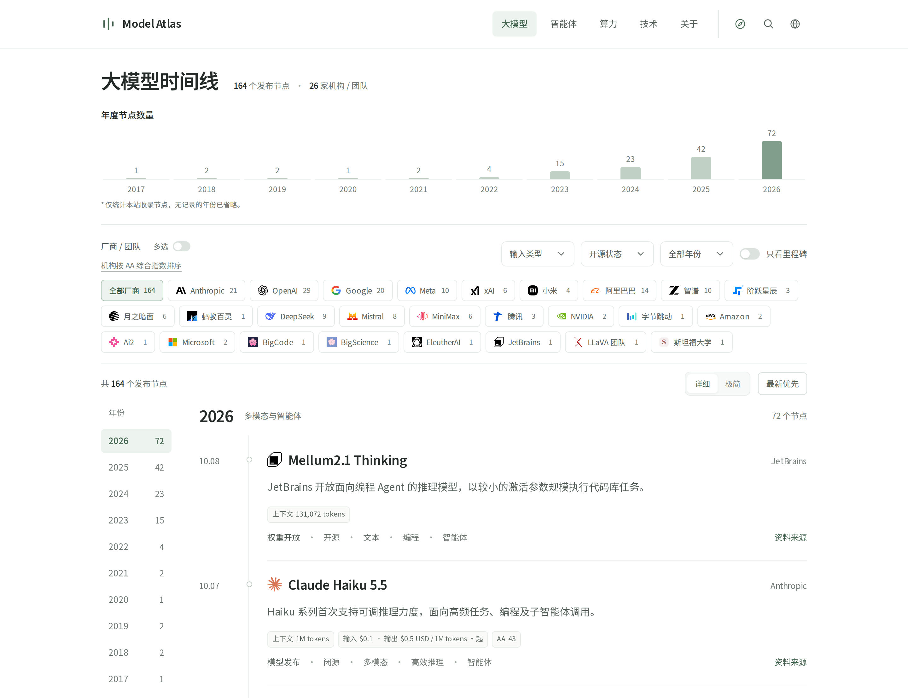
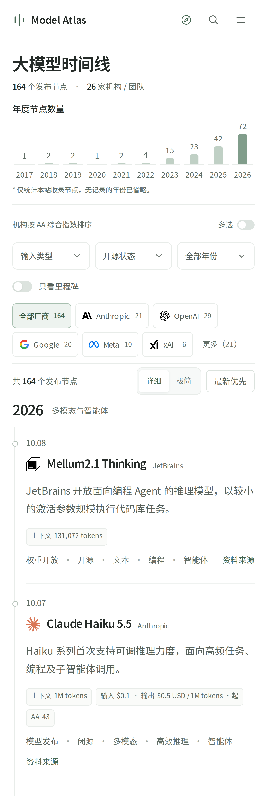
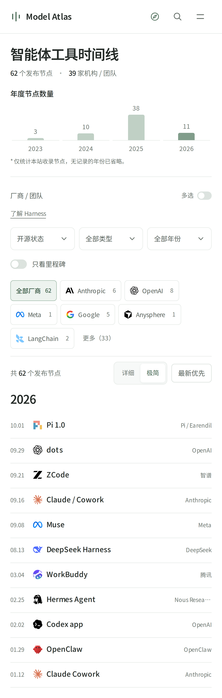
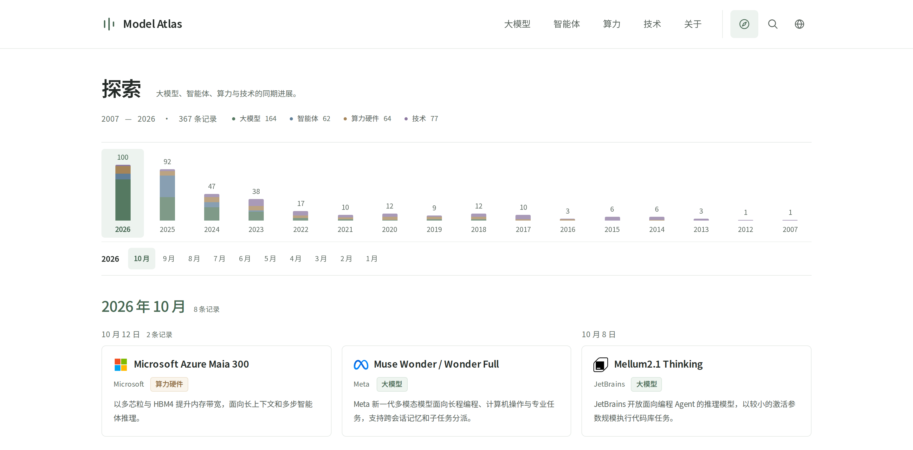

# Model Atlas

AI 模型、智能体、算力硬件与关键技术的发展时间线。

[English](README.md) · 简体中文

[在线访问](https://ai.taifua.com) · [参与贡献](#参与贡献) · [许可](#许可)



<details>
<summary>移动端预览</summary>

左：大模型详细视图；右：智能体极简视图。

<p align="center">
  
  
</p>

</details>

<details>
<summary>探索页预览</summary>



</details>

## 四条时间线

| 板块 | 内容 |
| --- | --- |
| [大模型](https://ai.taifua.com/) | 语言、多模态、图像与视频生成、世界模拟及机器人动作模型发布，附架构论文、可核实的规格和评测快照。 |
| [智能体](https://ai.taifua.com/agents.html) | 编程与通用智能体、Harness、框架和协议。 |
| [算力硬件](https://ai.taifua.com/hardware.html) | GPU、专用加速器、算力系统与本地设备，规格注明具体配置。 |
| [技术](https://ai.taifua.com/technology.html) | 基础方法、计算框架、推理部署、容器与沙箱。 |

优先收录经典、具有技术代表性或可验证影响力的事件。每个节点保留来源与日期口径，以资料质量为先。

## 浏览功能

- 搜索四条时间线，按机构、年份、任务或类型筛选，通过链接分享当前结果。
- 详细卡片与极简列表，默认最新优先；节点附来源、日期，以及可核实的规格、价格或评测快照。
- 年度与月度图表跟随当前筛选。列表分批展示，选择年份或筛选条件后展开对应记录。
- 页头指南针进入[探索页](https://ai.taifua.com/explore.html)，按月与日期串联四条时间线；[评测页](https://ai.taifua.com/benchmarks.html)按领域整理公开榜单，说明方法和比较范围。
- 支持中英文、桌面与移动端、键盘操作及减少动画偏好；每种语言都有独立地址。

网站为纯静态页面，搜索、筛选和图表均在浏览器中运行。生成的 HTML 包含完整记录，关闭 JavaScript 也可阅读。字体与图标在本地加载。

## 隐私

源码与默认构建不含统计脚本或统计服务请求，语言与视图偏好保存在浏览器中。[ai.taifua.com](https://ai.taifua.com) 的访问统计在部署时单独配置，仅在访客允许后加载；拒绝不影响使用。隐私说明和修改选择的入口位于[关于页](https://ai.taifua.com/about.html#privacy)，统计选择保留 180 天。

## 本地运行

使用 **Node.js 22 或 24 LTS**。本地预览、数据检查和构建无需安装 npm 依赖；浏览器测试使用开发依赖。

```bash
git clone https://github.com/taifuer/model-atlas.git
cd model-atlas
npm run dev
```

打开 [localhost:5173](http://localhost:5173)。也可指定监听地址与端口：

```bash
npm run dev -- --host 127.0.0.1 --port 5173
```

预览统计提示及关于页的选择入口，可运行 `npm run dev -- --preview-analytics`；此模式仅演示交互，不加载统计服务或发送统计数据。

## 检查与构建

```bash
npm run check
npm test
npm run build
```

构建结果位于 `dist/`，包含七类页面的中英文版本、站点地图及本地资源，可部署到任何静态托管服务。默认节点、日期、摘要、来源和统计在构建时写入 HTML，关闭 JavaScript 也能阅读；浏览器脚本提供筛选、搜索和详情交互。线上无需 Node.js 进程或后端。资源链接附带内容哈希，便于更新缓存。GitHub Actions 在 Node.js 22 和 24 上运行相同检查，并独立运行 Chromium 浏览器回归测试。

首次运行浏览器检查时：

```bash
npm ci
npx playwright install chromium
npm run test:browser
```

测试自动构建并启动本地静态服务器，覆盖中英文、桌面与移动端的详情历史、全站搜索、短屏弹窗、静态正文、字体请求和可选的统计同意流程。测试依赖不会进入站点构建或线上运行环境。

中文页面位于站点根目录，英文页面位于 `/en/`。构建时写入每页的双语标题、描述、关键词、canonical、hreflang 与社交分享元信息，并生成 `sitemap.xml` 和 `robots.txt`。部署到其他域名时使用 `BASE_URL=https://example.com npm run build`。既有 `?lang=en` / `?lang=zh` 链接继续兼容。

## 数据与来源

数据由人工维护，不自动同步。论文、公告、预览、正式发布和实际可用日期分别记录；规格与价格对应明确的版本和配置，榜单成绩保留指标口径、核对日期及可获取的榜单日期。无法核实的信息不补猜测值。

模型与智能体的评测入口、方法及比较范围见[评测页](https://ai.taifua.com/benchmarks.html)；算力评测参考 [MLPerf](https://mlcommons.org/benchmarks/inference-datacenter/)。不同榜单分数分别记录，不混算。

页面中的“开源 / 闭源”是对所收录模型与工具的编辑分类，与本项目的源码许可证无关，也不能替代各产品的实际许可条款。详细口径见[关于页](https://ai.taifua.com/about.html?lang=zh)。

<details>
<summary>维护工具：来源巡检与候选审核</summary>

维护者可手动检查目录中已引用的来源：

```bash
npm run check:sources -- --section models --limit 8
npm run check:sources -- --scope price,score --priority high
npm run check:sources -- --scope license,specification --list
npm run check:sources -- --help
```

报告和规范化正文快照仅保存在 Git 忽略的 `research/source-monitor/`，不会进入站点构建。复核清单将价格、评分、许可与规格资料标为高优先级，保留节点 ID 及原文段落链接。页面变化只是待复核线索，不代表事实已更新；403、429 和网络错误与 404、410 分别记录，均不会自动删节点或覆盖旧证据。HTML 对比会排除脚本和大部分导航，但动态正文仍可能产生差异。

首次运行尚无已接受的基线。先核对文档身份、可见内容及相关版本或配置，再使用报告中的完整来源 ID 接受已复核的快照：

```bash
npm run check:sources -- --accept research/source-monitor/reports/<report>.json --source <source-id>,<source-id>
```

同一报告可以分批接受。失败结果不能接受；其他报告改动基线后，需要重新检查。报告开始分批接受后若被修改，也不能继续接受该报告。省略 `--source` 会接受报告中全部成功结果，仅在逐项复核后使用。接受快照只更新私有比较基线，不修改网站数据或核对日期。页面变化仍需事实核查，尤其要注意实时页面是否已切换到其他模型版本。规范化版本变化会标记为待复核，不会自动接受新基线。超过大小限制的页面明确记录为失败；针对性检查可用 `--max-bytes` 将默认 4 MiB 上限提高至最多 16 MiB。

另一个手动命令从少量已核实的官方新闻源、公开 GitHub 发布源及 AA / Arena 模型列表采集候选：

```bash
npm run discover:candidates -- --list
npm run discover:candidates -- --since 2026-10-01
npm run discover:candidates -- --source claude-code,arena-text --limit 10
```

`scripts/candidate-sources.json` 说明各来源的覆盖范围，属于起步清单，不是完整发布索引。`--limit` 限制每个来源的候选数量；`--since` 仅筛选有明确发布日期的记录，日期未知或仅有月份的候选继续保留待审。上榜时间或订阅源修改时间不会代替发布日期。

AA 采集同时识别单型号与多配置发布卡片。页面标明可见数量时，解析器先核对完整性，再应用数量限制；漏项会明确报错，并保留原有候选记录。

报告、原始快照及 `queue.json` 仅保存在 Git 忽略的 `research/candidate-discovery/`。先生成易读的私有摘要，逐条核对来源与收录标准，再记录明确决定：

```bash
npm run review:candidates -- --since 2026-10-12
npm run review:candidates -- --source artificial-analysis --status needs_review,deferred
npm run review:candidates -- --from research/candidate-discovery/reviews/<summary>.json --id <完整候选ID> --decide represented --note "相同发布已由现有节点覆盖。" --entry models/<节点ID> --evidence https://example.com/release
```

审核命令的 `--since` 指**首次观察或内容变化时间**，不是发布日期。摘要展示完整 ID、来源摘要、发布日期精度、已有理由与节点匹配建议。“新发现”“内容变化”“疑似已有节点”可以重叠；默认只看 `needs_review`，`--status all` 可包含已有决定。JSON 与 Markdown 摘要均保存在私有 `reviews/` 目录。

可记录已覆盖（`represented`）、暂缓（`deferred`）、不收录（`rejected`）或待审（`needs_review`）。每次决定必须说明理由；已覆盖必须指定现有节点，已覆盖和不收录还需提供依据链接。每批决定后需重新生成摘要。未知 ID、无效节点映射、并发写入及摘要生成后的队列变化都会被拒绝。候选内容实质变化后重新待审，变化日期持续保留，此前决定、映射与依据进入 `reviewHistory`；重复观察不重复建项。采集记录是研究线索，不等于新发布或已通过收录。这些工具均不自动导入分数、添加站点节点、定时运行或发送通知；内容发布仍需人工审核并通过项目检查。

</details>

## 项目结构

| 文件 | 用途 |
| --- | --- |
| `src/` | 站点源码：七个页面模板、前端 JavaScript、CSS、数据及 favicon。 |
| `src/data*.js` | 双语节点、分类、规格、价格及榜单快照。 |
| `src/app.js`、`src/filters.js`、`src/site.js`、`src/icons.js`、`src/styles.css` | 渲染、筛选、导航、语言与排版。 |
| `src/assets/` | 本地字体、图标及许可声明。 |
| `scripts/` | 开发服务器、静态构建、手动来源巡检、候选采集与审核，以及可选的字体子集工具。 |
| `tests/` | 数据与交互逻辑检查，包含带日期的评分快照样本，以及 `tests/browser/` 中的浏览器回归检查。 |
| `docs/` | 文档资源，包括桌面与移动端预览图。 |
| `dist/` | 自动生成的静态站点，不提交到 Git。 |

在 `src/` 中修改站点，从仓库根目录执行 npm 命令。字体维护方法见 [FONT-NOTICE.md](src/assets/FONT-NOTICE.md)。私有研究笔记、本地配置与部署备份不进入仓库或站点构建。

## 参与贡献

欢迎通过 Issue 或 Pull Request 补充与纠错。

- 说明节点的历史地位、技术代表性或可验证影响力；硬件应区分有据可查的架构贡献与具体芯片或系统的实际采用情况。
- 提供可靠来源和事件日期，规格、价格与评分对应明确版本或配置；自行撰写摘要，不整页搬运来源内容。
- 同时更新中英文，保留稳定 ID，无法核实的信息留空。
- 运行 `npm run check`、`npm test` 和 `npm run build`；界面变更还需检查移动端与桌面端布局。

## 许可

项目原创源码与原创编辑性文案采用 [MIT 许可证](LICENSE)。Noto Sans SC 字体采用 [SIL Open Font License 1.1](src/assets/OFL.txt)，详见[字体说明](src/assets/FONT-NOTICE.md)；图标来源及已记录的许可见[图标声明](src/assets/icons/NOTICE.md)。

外部数据、评测资料与品牌标识不统一适用 MIT，仍遵循各自权利与条款。本项目独立维护，与所收录机构不存在隶属关系。

Arena 分数快照取自其 [官方数据集](https://huggingface.co/datasets/lmarena-ai/leaderboard-dataset)，适用 CC BY 4.0；展示分数与置信区间经过取整，并保留来源日期。
